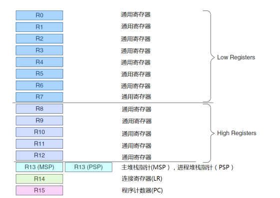
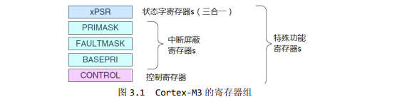
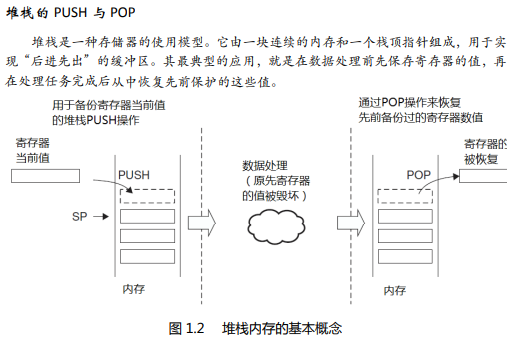
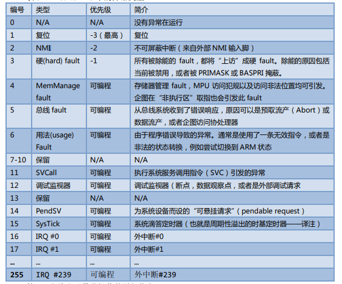
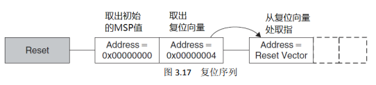
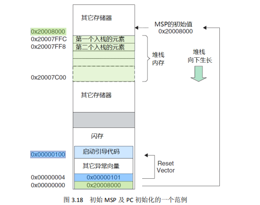

# 1. 寄存器组

## 1.1 通用目的寄存器 R0-R7

    R0-R7 也被称为低组寄存器。所有指令都能访问它们。它们的字长全是 32 位，复位后的初始值是不可预料的。

## 1.2 通用目的寄存器 R8-R12

    R8-R12 也被称为高组寄存器。这是因为只有很少的 16 位 Thumb 指令能访问它们，32 位的thumb-2 指令则不受限制。它们也是 32 位字长，且复位后的初始值是不可预料的。

## 1.3 特殊功能寄存器：



| 寄存器    | 功能                                                                                    |
| --------- | --------------------------------------------------------------------------------------- |
| xPSR      | 记录 ALU 标志（0 标志，进位标志，负数标志，溢出标志），执行状态，以及当前正服务的中断号 |
| PRIMASK   | 除能所有的中断——当然了，不可屏蔽中断（NMI）才不甩它呢。                               |
| FAULTMASK | 除能所有的 fault——NMI 依然不受影响，而且被除能的 faults 会“上访”                    |
| BASEPRI   | 除能所有优先级不高于某个具体数值的中断                                                  |
| CONTROL   | 定义特权状态（见后续章节对特权的叙述），并且决定使用哪一个堆栈指针                      |
|           |                                                                                         |
|           |                                                                                         |

## 1.4 堆栈指针 R13

    R13 是堆栈指针。在 CM3 处理器内核中共有两个堆栈指针，于是也就支持两个堆栈。当引用 R13（或写作 SP）时，引用到的是当前正在使用的那一个，另一个必须用特殊的指令来访问（MRS,MSR
指令）。这两个堆栈指针分别是：

* 主堆栈指针（MSP），或写作 SP_main。这是缺省的堆栈指针，它由 OS 内核、异常服务例程以及所有需要特权访问的应用程序代码来使用。
* 进程堆栈指针（PSP），或写作 SP_process。用于常规的应用程序代码
  
* **在执行 PUSH 和 POP 操作时，那个通常被称为 SP 的地址寄存器，会由硬件自动调整它的值，以避免后续操作破坏先前的数据。**
* 在 Cortex-M3 中，有专门的指令负责堆栈操作——PUSH 和 POP。它俩的汇编语言语法如下例所
  演示
  ```
  PUSH {R0} ; *(--R13)=R0。R13 是 long*的指针
  POP {R0} ; R0= *R13++

  subroutine_1
    PUSH {R0-R7, R12, R14} ; 保存寄存器列表
    ... ; 执行处理
    POP {R0-R7, R12, R14} ; 恢复寄存器列表
    BX R14 ; 返回到主调函数
  ```

## 1.5 连接寄存器 R14

    R14 是连接寄存器（LR）。在一个汇编程序中，你可以把它写作 both LR 和 R14。LR 用于在调用子程序时存储返回地址。例如，当你在使用 BL(分支并连接，Branch and Link)指令时，就自动填充LR的值。

```
main ;主程序
    ...
    BL function1 ; 使用“分支并连接”指令呼叫 function1
                 ; PC= function1，并且 LR=main 的下一条指令地址
    ...
Function1
    ...          ; function1 的代码
    BX LR        ; 函数返回（如果 function1 要使用 LR，必须在使用前 PUSH，; 否则返回时程序就可能跑飞了——译注）
```

## 1.6 程序计数器 R15

    R15 是程序计数器，在汇编代码中一般我们都都叫它的外“PC”。因为 CM3 内部使用了指令流水线，读 PC 时返回的值是当前指令的地址+4。比如说：

```
0x1000: MOV R0, PC ; R0 = 0x1004
```

    如果向 PC 中写数据，就会引起一次程序的分支（但是不更新 LR 寄存器）。CM3 中的指令至少是半字对齐的，所以 PC 的 LSB 总是读回 0。然而，在分支时，无论是直接写 PC 的值还是使用分支指令，都必须保证加载到 PC 的数值是奇数（即 LSB=1），用以表明这是在 Thumb 状态下执行。倘若写了 0，则视为企图转入 ARM 模式，CM3 将产生一个 fault 异常。

# 2. 中断

* Cortex-M3 在进入异常服务例程时，自动压栈了 R0-R3, R12, LR, PSR 和 PC，并且在返回时自动弹出它们，这多清爽！既加速了中断的响应，也再不需要汇编语言代码了
* Cortex-M3 支持大量异常，包括 16-4-1=11 个系统异常，和最多 240 个外部中断——简称 IRQ。具体使用了这 240 个中断源中的多少个，则由芯片制造商决定。由外设产生的中断信号，除了 SysTick的之外，全都连接到 NVIC 的中断输入信号线
  

## 2.1 向量表

    CM3 内核响应了一个发生的异常后，对应的异常服务例程(ESR)就会执行。为了决定 ESR 的入口地址，CM3 使用了“向量表查表机制”。这里使用一张向量表。向量表其实是一个 WORD（32 位整数）数组，每个下标对应一种异常，该下标元素的值则是该 ESR 的入口地址。向量表在地址空间中的位置是可以设置的，通过 NVIC 中的一个重定位寄存器来指出向量表的地址。在复位后，该寄存器的值为 0。因此，在地址 0 处必须包含一张向量表，用于初始时的异常分配。

| 异常类型 | 表项地址偏移量 | 异常向量        |
| -------- | -------------- | --------------- |
| 0        | 0x00           | MSP 的初始值    |
| 1        | 0x04           | 复位            |
| 2        | 0x08           | NMI             |
| 3        | 0x0C           | 硬 fault        |
| 4        | 0x10           | MemManage fault |
| 5        | 0x14           | 总线 fault      |
| 6        | 0x18           | 用法 fault      |
| 7-10     | 0x1c-0x28      | 保留            |
| 11       | 0x2c           | SVC             |
| 12       | 0x30           | 调试监视器      |
| 13       | 0x34           | 保留            |
| 14       | 0x38           | PendSV          |
| 15       | 0x3c           | SysTick         |
| 16       | 0x40           | IRQ #0          |
| 17       | 0x44           | IRQ #1          |
| 18-255   | 0x48-0x3FF     | IRQ #2 - #239   |

    举个例子，如果发生了异常 11（SVC），则 NVIC 会计算出偏移移量是 11x4=0x2C，然后从那里取出服务例程的入口地址并跳入。要注意的是这里有个另类：0 号类型并不是什么入口地址，而是给出了复位后 MSP 的初值。

## 复位序列

在离开复位状态后，CM3 做的第一件事就是读取下列两个 32 位整数的值：

* 从地址 0x0000,0000 处取出 MSP 的初始值。
* 从地址 0x0000,0004 处取出 PC 的初始值——这个值是复位向量，LSB 必须是 1。然后从这个值所对应的地址处取指。
  

  请注意，这与传统的 ARM 架构不同——其实也和绝大多数的其它单片机不同。传统的 ARM 架构总是从 0 地址开始执行第一条指令。它们的 0 地址处总是一条跳转指令。在 CM3 中，在 0 地址处提供 MSP 的初始值，然后紧跟着就是向量表（向量表在以后还可以被移至其它位置——译注）。向量表中的数值是 32 位的地址，而不是跳转指令。向量表的第一个条目指向复位后应执行的第一条指令
 
