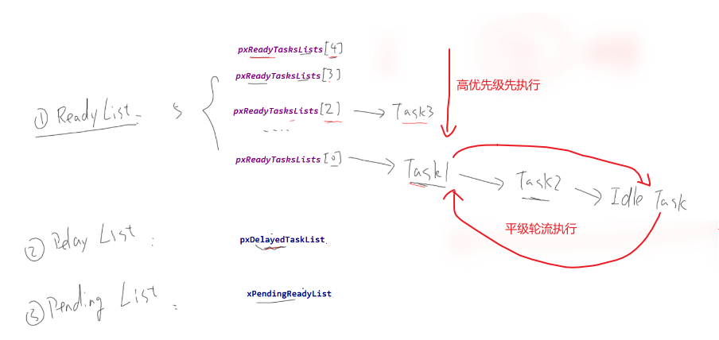
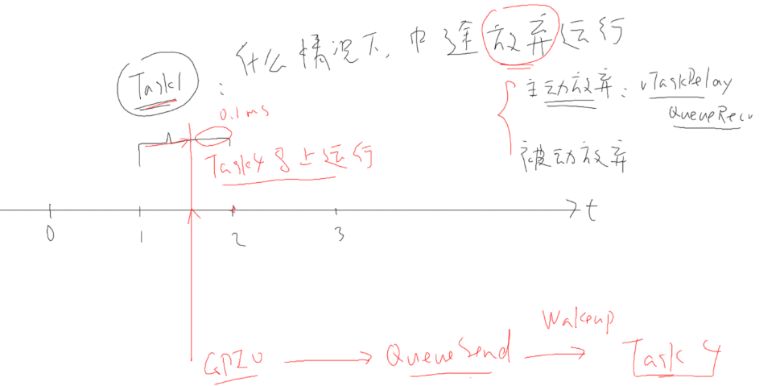
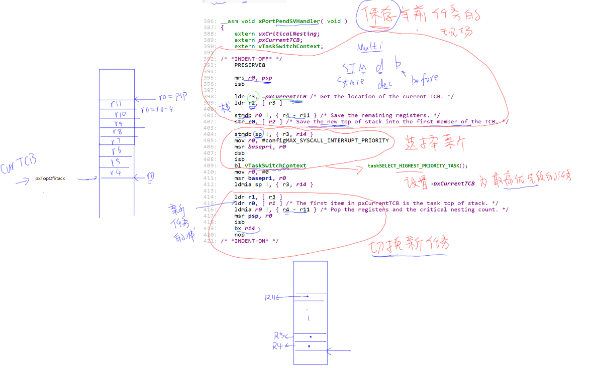

# 一.任务控制块

## 1.1. 最小任务控制块结构（将可选的配置部分去掉）

```C
typedef struct tskTaskControlBlock       /* The old naming convention is used to prevent breaking kernel aware debuggers. */
{
    volatile StackType_t * pxTopOfStack; /*< Points to the location of the last item placed on the tasks stack.  THIS MUST BE THE FIRST MEMBER OF THE TCB STRUCT. */

    ListItem_t xStateListItem;                  /*< The list that the state list item of a task is reference from denotes the state of that task (Ready, Blocked, Suspended ). */
    ListItem_t xEventListItem;                  /*< Used to reference a task from an event list. */
    UBaseType_t uxPriority;                     /*< The priority of the task.  0 is the lowest priority. */
    StackType_t * pxStack;                      /*< Points to the start of the stack. */
    char pcTaskName[ configMAX_TASK_NAME_LEN ]; /*< Descriptive name given to the task when created.  Facilitates debugging only. */ /*lint !e971 Unqualified char types are allowed for strings and single characters only. */
} tskTCB;
```

## 1.2. 任务地址和参数

    从TCB控制块中，我们并未看到保存任务地址和参数。这些其实在创建任务时直接保存到栈上

```C
StackType_t * pxPortInitialiseStack( StackType_t * pxTopOfStack,
                                     TaskFunction_t pxCode,
                                     void * pvParameters )
{
    /* Simulate the stack frame as it would be created by a context switch
     * interrupt. */
    pxTopOfStack--;                                                      /* Offset added to account for the way the MCU uses the stack on entry/exit of interrupts. */
    *pxTopOfStack = portINITIAL_XPSR;                                    /* xPSR */
    pxTopOfStack--;
    *pxTopOfStack = ( ( StackType_t ) pxCode ) & portSTART_ADDRESS_MASK; /* PC */
    pxTopOfStack--;
    *pxTopOfStack = ( StackType_t ) prvTaskExitError;                    /* LR */

    pxTopOfStack -= 5;                                                   /* R12, R3, R2 and R1. */
    *pxTopOfStack = ( StackType_t ) pvParameters;                        /* R0 */
    pxTopOfStack -= 8;                                                   /* R11, R10, R9, R8, R7, R6, R5 and R4. */

    return pxTopOfStack;
}
```

## 1.3. 优先级

* 高优先级的任务，优先执行，可以抢占低优先级的任务
* 高优先级的任务不停止，低优先级的任务永远无法执行
* 同等优先级的任务，轮流执行：时间片轮转

## 1.4. 状态

* 运行态：running
* 就绪态：ready
* 阻塞：blocked，等待某件事(时间、事件)
* 暂停：suspend，休息去了

## 1.5. 任务切换顺序

* 找到最高优先级的运行态、就绪态任务，运行它
* 高优先级任务不退出或阻塞，低优先级永远得不到运行。
* 如果大家平级，轮流执行：排队，链表前面的先运行，运行1个tick后乖乖地去链表尾部排队

# 二. 任务态数据结构

    2.1.  所有TCB通过各种链表串联起来

    2.2. freertos有多种链表

```C/C++
static List_t pxReadyTasksLists[ configMAX_PRIORITIES ]; /*< Prioritised ready tasks. */
static List_t xDelayedTaskList1;                         /*< Delayed tasks. */
static List_t xDelayedTaskList2;                         /*< Delayed tasks (two lists are used - one for delays that have overflowed the current tick count. */
static List_t * volatile pxDelayedTaskList;              /*< Points to the delayed task list currently being used. */
static List_t * volatile pxOverflowDelayedTaskList;      /*< Points to the delayed task list currently being used to hold tasks that have overflowed the current tick count. */
static List_t xPendingReadyList;                         /*< Tasks that have been readied while the scheduler was suspended.  They will be moved to the ready list when the scheduler is resumed. */
```

**PS：这里就绪态链表是个数组，会把相同优先级的TCB串联起来。这样可以很好的管理优先级，这个很重要很重要**

    例如，我们定义configMAX_PRIORITIES = 4，创建2个优先级为0，一个优先级为2时。链表如下

2.3. task中途退让情况

1. 主动退让
2. 被动退让
   

# 三. 中断

## 3.1. xPortPendSVHandler中断

    保存和恢复任务现场
```c
__asm void xPortPendSVHandler( void )
{
    extern uxCriticalNesting;
    extern pxCurrentTCB;
    extern vTaskSwitchContext;

/* *INDENT-OFF* */
    PRESERVE8

    mrs r0, psp
    isb

    ldr r3, =pxCurrentTCB /* Get the location of the current TCB. */
    ldr r2, [ r3 ]

    stmdb r0 !, { r4 - r11 } /* Save the remaining registers. */
    str r0, [ r2 ] /* Save the new top of stack into the first member of the TCB. */

    stmdb sp !, { r3, r14 }
    mov r0, #configMAX_SYSCALL_INTERRUPT_PRIORITY
    msr basepri, r0
    dsb
    isb
    bl vTaskSwitchContext
    mov r0, #0
    msr basepri, r0
    ldmia sp !, { r3, r14 }

    ldr r1, [ r3 ]
    ldr r0, [ r1 ] /* The first item in pxCurrentTCB is the task top of stack. */
    ldmia r0 !, { r4 - r11 } /* Pop the registers and the critical nesting count. */
    msr psp, r0
    isb
    bx r14
    nop
/* *INDENT-ON* */
}
```
## 3.2. xPortSysTickHandler

    1. 产生tick节拍
    2. 判断delay list是否到期
          a. 到期后立马触发PSV中断

```c
void xPortSysTickHandler( void )
{
    /* The SysTick runs at the lowest interrupt priority, so when this interrupt
     * executes all interrupts must be unmasked.  There is therefore no need to
     * save and then restore the interrupt mask value as its value is already
     * known - therefore the slightly faster vPortRaiseBASEPRI() function is used
     * in place of portSET_INTERRUPT_MASK_FROM_ISR(). */
    vPortRaiseBASEPRI();
    {
        /* Increment the RTOS tick. */
        if( xTaskIncrementTick() != pdFALSE )
        {
            /* A context switch is required.  Context switching is performed in
             * the PendSV interrupt.  Pend the PendSV interrupt. */
            portNVIC_INT_CTRL_REG = portNVIC_PENDSVSET_BIT; //触发psv中断
        }
    }

    vPortClearBASEPRIFromISR();
}

BaseType_t xTaskIncrementTick( void )
{
    TCB_t * pxTCB;
    TickType_t xItemValue;
    BaseType_t xSwitchRequired = pdFALSE;

    /* Called by the portable layer each time a tick interrupt occurs.
     * Increments the tick then checks to see if the new tick value will cause any
     * tasks to be unblocked. */
    traceTASK_INCREMENT_TICK( xTickCount );

    if( uxSchedulerSuspended == ( UBaseType_t ) pdFALSE )
    {
        /* Minor optimisation.  The tick count cannot change in this
         * block. */
        const TickType_t xConstTickCount = xTickCount + ( TickType_t ) 1;

        /* Increment the RTOS tick, switching the delayed and overflowed
         * delayed lists if it wraps to 0. */
        xTickCount = xConstTickCount;

        if( xConstTickCount == ( TickType_t ) 0U ) /*lint !e774 'if' does not always evaluate to false as it is looking for an overflow. */
        {
            taskSWITCH_DELAYED_LISTS();
        }
        else
        {
            mtCOVERAGE_TEST_MARKER();
        }

        /* See if this tick has made a timeout expire.  Tasks are stored in
         * the  queue in the order of their wake time - meaning once one task
         * has been found whose block time has not expired there is no need to
         * look any further down the list. */
        if( xConstTickCount >= xNextTaskUnblockTime )
        {
            for( ; ; )
            {
                if( listLIST_IS_EMPTY( pxDelayedTaskList ) != pdFALSE )
                {
                    /* The delayed list is empty.  Set xNextTaskUnblockTime
                     * to the maximum possible value so it is extremely
                     * unlikely that the
                     * if( xTickCount >= xNextTaskUnblockTime ) test will pass
                     * next time through. */
                    xNextTaskUnblockTime = portMAX_DELAY; /*lint !e961 MISRA exception as the casts are only redundant for some ports. */
                    break;
                }
                else
                {
                    /* The delayed list is not empty, get the value of the
                     * item at the head of the delayed list.  This is the time
                     * at which the task at the head of the delayed list must
                     * be removed from the Blocked state. */
                    pxTCB = listGET_OWNER_OF_HEAD_ENTRY( pxDelayedTaskList ); /*lint !e9079 void * is used as this macro is used with timers and co-routines too.  Alignment is known to be fine as the type of the pointer stored and retrieved is the same. */
                    xItemValue = listGET_LIST_ITEM_VALUE( &( pxTCB->xStateListItem ) );

                    if( xConstTickCount < xItemValue )
                    {
                        /* It is not time to unblock this item yet, but the
                         * item value is the time at which the task at the head
                         * of the blocked list must be removed from the Blocked
                         * state -  so record the item value in
                         * xNextTaskUnblockTime. */
                        xNextTaskUnblockTime = xItemValue;
                        break; /*lint !e9011 Code structure here is deedmed easier to understand with multiple breaks. */
                    }
                    else
                    {
                        mtCOVERAGE_TEST_MARKER();
                    }

                    /* It is time to remove the item from the Blocked state. */
                    ( void ) uxListRemove( &( pxTCB->xStateListItem ) );

                    /* Is the task waiting on an event also?  If so remove
                     * it from the event list. */
                    if( listLIST_ITEM_CONTAINER( &( pxTCB->xEventListItem ) ) != NULL )
                    {
                        ( void ) uxListRemove( &( pxTCB->xEventListItem ) );
                    }
                    else
                    {
                        mtCOVERAGE_TEST_MARKER();
                    }

                    /* Place the unblocked task into the appropriate ready
                     * list. */
                    prvAddTaskToReadyList( pxTCB );

                    /* A task being unblocked cannot cause an immediate
                     * context switch if preemption is turned off. */
                    #if ( configUSE_PREEMPTION == 1 )
                        {
                            /* Preemption is on, but a context switch should
                             * only be performed if the unblocked task has a
                             * priority that is equal to or higher than the
                             * currently executing task. */
                            if( pxTCB->uxPriority >= pxCurrentTCB->uxPriority )
                            {
                                xSwitchRequired = pdTRUE;
                            }
                            else
                            {
                                mtCOVERAGE_TEST_MARKER();
                            }
                        }
                    #endif /* configUSE_PREEMPTION */
                }
            }
        }

        /* Tasks of equal priority to the currently running task will share
         * processing time (time slice) if preemption is on, and the application
         * writer has not explicitly turned time slicing off. */
        #if ( ( configUSE_PREEMPTION == 1 ) && ( configUSE_TIME_SLICING == 1 ) )
            {
                if( listCURRENT_LIST_LENGTH( &( pxReadyTasksLists[ pxCurrentTCB->uxPriority ] ) ) > ( UBaseType_t ) 1 )
                {
                    xSwitchRequired = pdTRUE;
                }
                else
                {
                    mtCOVERAGE_TEST_MARKER();
                }
            }
        #endif /* ( ( configUSE_PREEMPTION == 1 ) && ( configUSE_TIME_SLICING == 1 ) ) */

        #if ( configUSE_TICK_HOOK == 1 )
            {
                /* Guard against the tick hook being called when the pended tick
                 * count is being unwound (when the scheduler is being unlocked). */
                if( xPendedTicks == ( TickType_t ) 0 )
                {
                    vApplicationTickHook();
                }
                else
                {
                    mtCOVERAGE_TEST_MARKER();
                }
            }
        #endif /* configUSE_TICK_HOOK */

        #if ( configUSE_PREEMPTION == 1 )
            {
                if( xYieldPending != pdFALSE )
                {
                    xSwitchRequired = pdTRUE;
                }
                else
                {
                    mtCOVERAGE_TEST_MARKER();
                }
            }
        #endif /* configUSE_PREEMPTION */
    }
    else
    {
        ++xPendedTicks;

        /* The tick hook gets called at regular intervals, even if the
         * scheduler is locked. */
        #if ( configUSE_TICK_HOOK == 1 )
            {
                vApplicationTickHook();
            }
        #endif
    }

    return xSwitchRequired;
}
```

## 3.3. PSV中断
