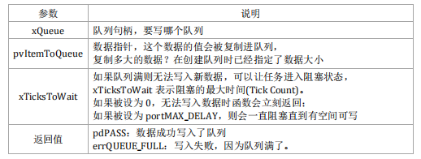
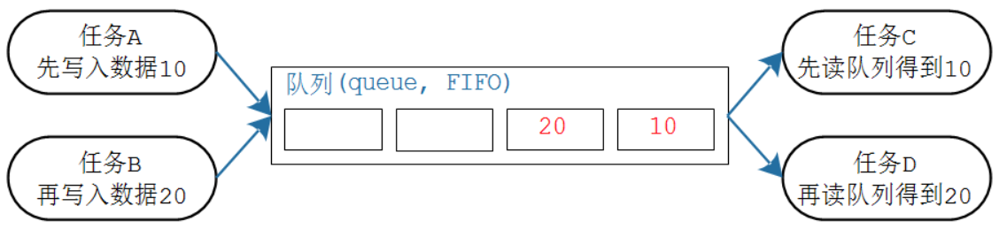
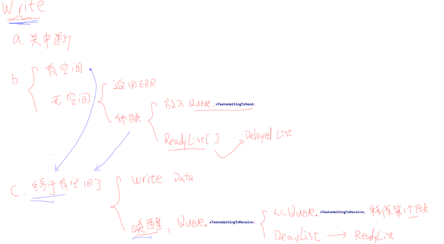
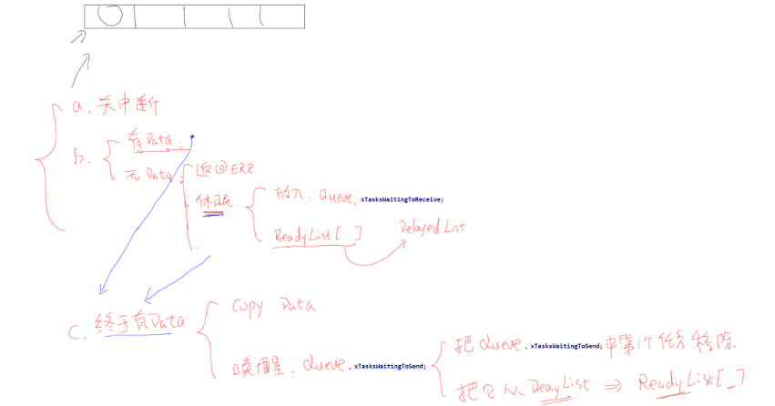

# 一.队列的使用方法

## 1.1. 队列的简化操如入下图所示，从此图可知：

* 队列可以包含若干个数据：队列中有若干项，这被称为"长度"(length)
* 每个数据大小固定
* 创建队列时就要指定长度、数据大小
* 数据的操作采用先进先出的方法(FIFO，First In First Out)：写数据时放到尾部，读数据时从头部读也可以强制写队列头部：覆盖头部数据

## 队列函数

* 创建

```C
/*
*动态分配内存api
*@prama: uxQueueLength 队列长度，最多能存放多少个数据(item)
*@prama: uxItemSize每个数据(item)的大小：以字节为单位
*return: 0 ：成功，返回句柄，以后使用句柄来操作队列
NULL：失败，因为内存不足
*/
QueueHandle_t xQueueCreate( UBaseType_t uxQueueLength, UBaseType_t uxItemSize)


/*
*静态分配内存api
*@prama: uxQueueLength 队列长度，最多能存放多少个数据(item)
*@prama: uxItemSize 每个数据(item)的大小：以字节为单位
*@prama: pucQueueStorageBuffer 如果 uxItemSize 非 0，pucQueueStorageBuffer 必须指向一个uint8_t 数组，此数组大小至少为"uxQueueLength*uxItemSize"
*@prama: pxQueueBuffer 必须执行一个 StaticQueue_t 结构体，用来保存队列的数据结构
*return: 0 ：成功，返回句柄，以后使用句柄来操作队列
NULL：失败，因为内存不足
*/
QueueHandle_t xQueueCreateStatic(UBaseType_t uxQueueLength, UBaseType_t uxItemSize,
 uint8_t *pucQueueStorageBuffer,StaticQueue_t *pxQueueBuffer);
```

* 复位

```C
// 队列刚被创建时，里面没有数据；使用过程中可以调用 xQueueReset()把队列恢复为初始状态
/* pxQueue : 复位哪个队列;
* 返回值: pdPASS(必定成功)
*/
BaseType_t xQueueReset( QueueHandle_t pxQueue);
```

* 删除

```C
//删除队列的函数为 vQueueDelete()，只能删除使用动态方法创建的队列，它会释放内存
void vQueueDelete( QueueHandle_t xQueue );
```

* 写队列

```C
/* 等同于 xQueueSendToBack
* 往队列尾部写入数据，如果没有空间，阻塞时间为 xTicksToWait
*/
BaseType_t xQueueSend(
 QueueHandle_t xQueue,
 const void *pvItemToQueue,
 TickType_t xTicksToWait
 );
/* 
* 往队列尾部写入数据，如果没有空间，阻塞时间为 xTicksToWait
*/
BaseType_t xQueueSendToBack(
 QueueHandle_t xQueue,
 const void *pvItemToQueue,
 TickType_t xTicksToWait
 );
/* 
* 往队列尾部写入数据，此函数可以在中断函数中使用，不可阻塞
*/
BaseType_t xQueueSendToBackFromISR(
 QueueHandle_t xQueue,
 const void *pvItemToQueue,
 BaseType_t *pxHigherPriorityTaskWoken
 );
/* 
* 往队列头部写入数据，如果没有空间，阻塞时间为 xTicksToWait
*/
BaseType_t xQueueSendToFront(
 QueueHandle_t xQueue,
 const void *pvItemToQueue,
 TickType_t xTicksToWait
 );
/* 
* 往队列头部写入数据，此函数可以在中断函数中使用，不可阻塞
*/
BaseType_t xQueueSendToFrontFromISR(
 QueueHandle_t xQueue,
 const void *pvItemToQueue,
 BaseType_t *pxHigherPriorityTaskWoken
 );
```
* 读队列

```C
/*
*读队列api
*@prama: xQueue 队列句柄，要读哪个队列
*@prama: pvBuffer bufer 指针，队列的数据会被复制到这个 buffer复制多大的数据？在创建队列时已经指定了数据大小
*@prama: xTicksToWait 果队列空则无法读出数据，可以让任务进入阻塞状态，xTicksToWait 表示阻塞的最大时间(Tick Count)。
如果被设为 0，无法读出数据时函数会立刻返回；
如果被设为 portMAX_DELAY，则会一直阻塞直到有数据可写
*return: pdPASS：从队列读出数据入
errQUEUE_EMPTY：读取失败，因为队列空了。
*/
BaseType_t xQueueReceive( QueueHandle_t xQueue, void * const pvBuffer, TickType_t xTicksToWait );

BaseType_t xQueueReceiveFromISR(QueueHandle_t xQueue, void *pvBuffer, BaseType_t *pxTaskWoken);
```

* 查询
```C
/*
* 返回队列中可用数据的个数
*/
UBaseType_t uxQueueMessagesWaiting( const QueueHandle_t xQueue );

/*
* 返回队列中可用空间的个数
*/
UBaseType_t uxQueueSpacesAvailable( const QueueHandle_t xQueue );
```

* 覆盖/偷看
```C
/* 当队列长度为 1 时，可以使用 xQueueOverwrite()或 xQueueOverwriteFromISR()来覆盖数据。
注意，队列长度必须为 1。当队列满时，这些函数会覆盖里面的数据，这也以为着这些函数不会被阻塞 */
/* 覆盖队列
* xQueue: 写哪个队列
* pvItemToQueue: 数据地址
* 返回值: pdTRUE 表示成功, pdFALSE 表示失败
*/
BaseType_t xQueueOverwrite(QueueHandle_t xQueue, const void * pvItemToQueue);

BaseType_t xQueueOverwriteFromISR(QueueHandle_t xQueue, const void * pvItemToQueue,BaseType_t*pxHigherPriorityTaskWoken)

/*如果想让队列中的数据供多方读取，也就是说读取时不要移除数据，要留给后来人。
那么可以使用"窥视"，也就是 xQueuePeek()或 xQueuePeekFromISR()。这些函数会从队列
中复制出数据，但是不移除数据。这也意味着，如果队列中没有数据，那么"偷看"时会导
致阻塞；一旦队列中有数据，以后每次"偷看"都会成功。*/
/* 偷看队列
* xQueue: 偷看哪个队列
* pvItemToQueue: 数据地址, 用来保存复制出来的数据
* 返回值: pdTRUE 表示成功, pdFALSE 表示失败
*/
BaseType_t xQueuePeek(QueueHandle_t xQueue, void * const pvBuffer, TickType_t xTicksToWait);

BaseType_t xQueuePeekFromISR(QueueHandle_t xQueue, void *pvBuffer,);
```
# 二.队列原理

## 2.1.  队列核心

* 互斥操作（开关中断实现）
* 队列环形缓冲区
* 队列链表



## 2.2. 队列源码分析

### 2.2.1. queue内存模型

在创建queu时。会根据queue长度和类型申请一段连续的heap

```c
 /* Allocate the queue and storage area.  Justification for MISRA
         * deviation as follows:  pvPortMalloc() always ensures returned memory
         * blocks are aligned per the requirements of the MCU stack.  In this case
         * pvPortMalloc() must return a pointer that is guaranteed to meet the
         * alignment requirements of the Queue_t structure - which in this case
         * is an int8_t *.  Therefore, whenever the stack alignment requirements
         * are greater than or equal to the pointer to char requirements the cast
         * is safe.  In other cases alignment requirements are not strict (one or
         * two bytes). */
        pxNewQueue = ( Queue_t * ) pvPortMalloc( sizeof( Queue_t ) + xQueueSizeInBytes ); /*lint !e9087 !e9079 see comment above. */
```

### 2.2.2. QueueHandle_t数据结构

* 队列可以作为信号量或mutex，在数据结构上用union来区分数据类型差异

```C
typedef struct QueueDefinition /* The old naming convention is used to prevent breaking kernel aware debuggers. */
{
    int8_t * pcHead;           /*< Points to the beginning of the queue storage area. */
    int8_t * pcWriteTo;        /*< Points to the free next place in the storage area. */

    union
    {
        QueuePointers_t xQueue;     /*< Data required exclusively when this structure is used as a queue. */
        SemaphoreData_t xSemaphore; /*< Data required exclusively when this structure is used as a semaphore. */
    } u;

    List_t xTasksWaitingToSend;             /*< List of tasks that are blocked waiting to post onto this queue.  Stored in priority order. */
    List_t xTasksWaitingToReceive;          /*< List of tasks that are blocked waiting to read from this queue.  Stored in priority order. */

    volatile UBaseType_t uxMessagesWaiting; /*< The number of items currently in the queue. */
    UBaseType_t uxLength;                   /*< The length of the queue defined as the number of items it will hold, not the number of bytes. */
    UBaseType_t uxItemSize;                 /*< The size of each items that the queue will hold. */

    volatile int8_t cRxLock;                /*< Stores the number of items received from the queue (removed from the queue) while the queue was locked.  Set to queueUNLOCKED when the queue is not locked. */
    volatile int8_t cTxLock;                /*< Stores the number of items transmitted to the queue (added to the queue) while the queue was locked.  Set to queueUNLOCKED when the queue is not locked. */

    #if ( ( configSUPPORT_STATIC_ALLOCATION == 1 ) && ( configSUPPORT_DYNAMIC_ALLOCATION == 1 ) )
        uint8_t ucStaticallyAllocated; /*< Set to pdTRUE if the memory used by the queue was statically allocated to ensure no attempt is made to free the memory. */
    #endif

    #if ( configUSE_QUEUE_SETS == 1 )
        struct QueueDefinition * pxQueueSetContainer;
    #endif

    #if ( configUSE_TRACE_FACILITY == 1 )
        UBaseType_t uxQueueNumber;
        uint8_t ucQueueType;
    #endif
} xQUEUE;
```

### 2.2.3. create 重要源码分析

```c
QueueHandle_t xQueueGenericCreate( const UBaseType_t uxQueueLength,
                                       const UBaseType_t uxItemSize,
                                       const uint8_t ucQueueType )
    {
        Queue_t * pxNewQueue;
        size_t xQueueSizeInBytes;
        uint8_t * pucQueueStorage;

        /* 计算队列缓存buff空间 */
        xQueueSizeInBytes = ( size_t ) ( uxQueueLength * uxItemSize ); /*lint !e961 MISRA exception as the casts are only redundant for some ports. */

       /* 申请队列空间 结构体空间+缓存buff空间*/
        pxNewQueue = ( Queue_t * ) pvPortMalloc( sizeof( Queue_t ) + xQueueSizeInBytes ); /*lint !e9087 !e9079 see comment above. */

        if( pxNewQueue != NULL )
        {
            /* Jump past the queue structure to find the location of the queue
             * storage area. */
            pucQueueStorage = ( uint8_t * ) pxNewQueue;
            /* 缓存buff开始地址*/
            pucQueueStorage += sizeof( Queue_t ); /*lint !e9016 Pointer arithmetic allowed on char types, especially when it assists conveying intent. */

             /* 队列结构体参数化*/
            prvInitialiseNewQueue( uxQueueLength, uxItemSize, pucQueueStorage, ucQueueType, pxNewQueue );
        }

        return pxNewQueue;
    }

static void prvInitialiseNewQueue( const UBaseType_t uxQueueLength,
                                   const UBaseType_t uxItemSize,
                                   uint8_t * pucQueueStorage,
                                   const uint8_t ucQueueType,
                                   Queue_t * pxNewQueue )
{
    if( uxItemSize == ( UBaseType_t ) 0 )
    {
        /* 如果队列item size为0， 这队列头指向queue handle.
        像mutex semaphore等 */
        pxNewQueue->pcHead = ( int8_t * ) pxNewQueue;
    }
    else
    {
        /* 这队列头指向queue 缓存buff起始地址*/
        pxNewQueue->pcHead = ( int8_t * ) pucQueueStorage;
    }

    /* Initialise the queue members as described where the queue type is
     * defined. */
    pxNewQueue->uxLength = uxQueueLength;  //初始化队列长度
    pxNewQueue->uxItemSize = uxItemSize;    //初始化item size
    ( void ) xQueueGenericReset( pxNewQueue, pdTRUE );

    #if ( configUSE_TRACE_FACILITY == 1 )
        {
            pxNewQueue->ucQueueType = ucQueueType;
        }
    #endif /* configUSE_TRACE_FACILITY */

    #if ( configUSE_QUEUE_SETS == 1 )
        {
            pxNewQueue->pxQueueSetContainer = NULL;
        }
    #endif /* configUSE_QUEUE_SETS */

    traceQUEUE_CREATE( pxNewQueue );
}
BaseType_t xQueueGenericReset( QueueHandle_t xQueue,
                               BaseType_t xNewQueue )
{
    Queue_t * const pxQueue = xQueue;

    taskENTER_CRITICAL();
    {
        pxQueue->u.xQueue.pcTail = pxQueue->pcHead + ( pxQueue->uxLength * pxQueue->uxItemSize ); /*lint !e9016 Pointer arithmetic allowed on char types, especially when it assists conveying intent. */
        pxQueue->uxMessagesWaiting = ( UBaseType_t ) 0U;
        pxQueue->pcWriteTo = pxQueue->pcHead;
        pxQueue->u.xQueue.pcReadFrom = pxQueue->pcHead + ( ( pxQueue->uxLength - 1U ) * pxQueue->uxItemSize ); /*lint !e9016 Pointer arithmetic allowed on char types, especially when it assists conveying intent. */
        pxQueue->cRxLock = queueUNLOCKED;
        pxQueue->cTxLock = queueUNLOCKED;

        if( xNewQueue == pdFALSE )
        {
            /* If there are tasks blocked waiting to read from the queue, then
             * the tasks will remain blocked as after this function exits the queue
             * will still be empty.  If there are tasks blocked waiting to write to
             * the queue, then one should be unblocked as after this function exits
             * it will be possible to write to it. */
            if( listLIST_IS_EMPTY( &( pxQueue->xTasksWaitingToSend ) ) == pdFALSE )
            {
                if( xTaskRemoveFromEventList( &( pxQueue->xTasksWaitingToSend ) ) != pdFALSE )
                {
                    queueYIELD_IF_USING_PREEMPTION();
                }
                else
                {
                    mtCOVERAGE_TEST_MARKER();
                }
            }
            else
            {
                mtCOVERAGE_TEST_MARKER();
            }
        }
        else
        {
            /* Ensure the event queues start in the correct state. */
            vListInitialise( &( pxQueue->xTasksWaitingToSend ) );
            vListInitialise( &( pxQueue->xTasksWaitingToReceive ) );
        }
    }
    taskEXIT_CRITICAL();

    /* A value is returned for calling semantic consistency with previous
     * versions. */
    return pdPASS;
}
```

### 2.2.3. 发送队列



### 2.2.3. 读队列


