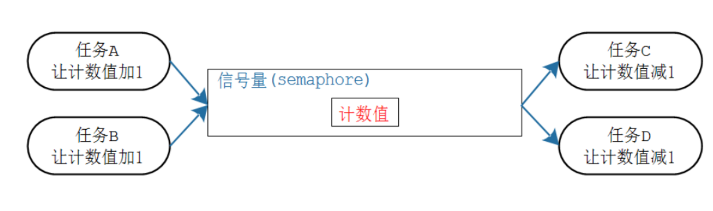
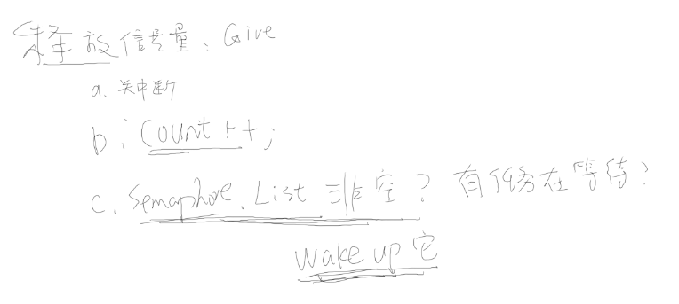
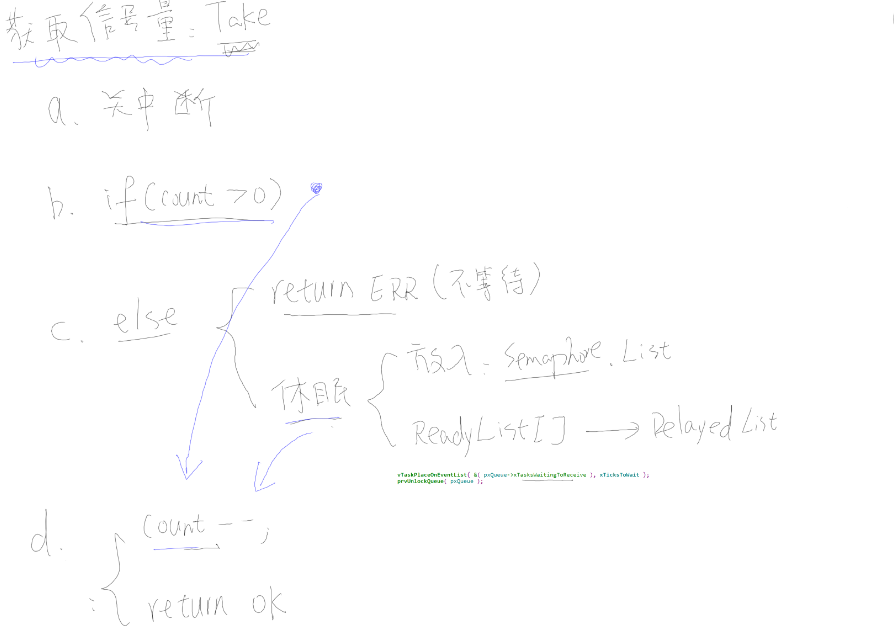

# 一. 信号量使用说明

    1.1 信号量分为两种：

* 计数信号量
* 二进制信号量
  **PS：二进制信号量跟计数型的唯一差别，就是计数值的最大值被限定为 1。**

## 1.2. 在freertos中信号量和队列关系

* 信号量是一种特殊队列（队列buffer为0）
* 信号量信号量的本质是队列
  
* 信号量跟队列的对比

| 队列                                                                                   | 信号量                                                                           |
| -------------------------------------------------------------------------------------- | -------------------------------------------------------------------------------- |
| 1. 可以容纳多个数据<br />2. 创建队列时有 2 部分内存: 队列结构体、存<br />储数据的空间 | 1. 只有计数值，无法容纳其他数据。<br />2. 创建信号量时，只需要分配信号量结构体 |
| 生产者：没有空间存入数据时可以阻塞                                                     | 生产者：用于不阻塞，计数值已经达到最大时返回失败                                 |
| 消费者：没有数据时可以阻塞                                                             | 消费者：没有资源时可以阻塞                                                       |

* 二进制和计数信号量差别| 二进制信号量       | 计数信号量             |
  | ------------------ | ---------------------- |
  | 被创建时初始值为 0 | 被创建时初始值可以设定 |
  | 其他操作是一样的   | 其他操作是一样的       |

## 1.2. 信号量函数

### 1.2.1. 创建函数

|          | 二进制信号量                                 | 计数信号量                     |
| -------- | -------------------------------------------- | ------------------------------ |
| 动态创建 | xSemaphoreCreateBinary<br />计数值初始值为 0 | xSemaphoreCreateCounting       |
| 静态创建 | xSemaphoreCreateBinaryStatic                 | xSemaphoreCreateCountingStatic |

* 创建二进制信号量api

```C
/* 创建一个二进制信号量，返回它的句柄。
* 此函数内部会分配信号量结构体
* 返回值: 返回句柄，非 NULL 表示成功
*/
SemaphoreHandle_t xSemaphoreCreateBinary( void );
/* 创建一个二进制信号量，返回它的句柄。
* 此函数无需动态分配内存，所以需要先有一个 StaticSemaphore_t 结构体，并传入它的指
针
* 返回值: 返回句柄，非 NULL 表示成功
*/
SemaphoreHandle_t xSemaphoreCreateBinaryStatic( StaticSemaphore_t *pxSemaphoreBuffe
r );
```

* 创建计数信号量api

```C
/* 创建一个计数型信号量，返回它的句柄。
* 此函数内部会分配信号量结构体
* uxMaxCount: 最大计数值
* uxInitialCount: 初始计数值
* 返回值: 返回句柄，非 NULL 表示成功
*/
SemaphoreHandle_t xSemaphoreCreateCounting(UBaseType_t uxMaxCount, UBaseType_t ux
InitialCount);
/* 创建一个计数型信号量，返回它的句柄。
* 此函数无需动态分配内存，所以需要先有一个 StaticSemaphore_t 结构体，并传入它的指
针
* uxMaxCount: 最大计数值
* uxInitialCount: 初始计数值
* pxSemaphoreBuffer: StaticSemaphore_t 结构体指针
* 返回值: 返回句柄，非 NULL 表示成功
*/
SemaphoreHandle_t xSemaphoreCreateCountingStatic( UBaseType_t uxMaxCount,
 UBaseType_t uxInitialCount,
 StaticSemaphore_t *pxSemaphoreBuffer );
```

## 1.3.删除

* vSemaphoreDelete 可以用来删除二进制信号量、计数型信号量，函数原型如下：

```C
/*
* xSemaphore: 信号量句柄，你要删除哪个信号量
*/
void vSemaphoreDelete( SemaphoreHandle_t xSemaphore );

```

## 1.4. give/take信号量

* 二进制信号量、计数型信号量的 give、take 操作函数是一样的，但这些函数也分为 2 个版本：给任务使用，给 ISR 使用

|      | 在任务中使用   | 在 ISR 中使用         |
| ---- | -------------- | --------------------- |
| give | xSemaphoreGive | xSemaphoreGiveFromISR |
| take | xSemaphoreTake | xSemaphoreTakeFromISR |

* xSemaphoreGive 的函数API:

```C
/*
* @param: xSemaphore 信号量句柄，give哪个信号量
* @return: pdTRUE 表示成功,
如果二进制信号量的计数值已经是 1，再次调用此函数则返回失败；
如果计数型信号量的计数值已经是最大值，再次调用此函数则返回失败
*/
BaseType_t xSemaphoreGive( SemaphoreHandle_t xSemaphore );

/*
* @param: xSemaphore 信号量句柄，take哪个信号量
* @param: xTicksToWait 0：不阻塞，马上返回 portMAX_DELAY: 一直阻塞直到成功
* @return: pdTRUE 表示成功,
*/
BaseType_t xSemaphoreTake(SemaphoreHandle_t xSemaphore, TickType_t xTicksToWait);


/*
* @param: xSemaphore 信号量句柄，give哪个信号量
* @param: pxHigherPriorityTaskWoken 如果释放信号量导致更高优先级的任务变为了就绪态，
则*pxHigherPriorityTaskWoken = pdTRUE
* @return: pdTRUE 表示成功,
*/
BaseType_t xSemaphoreGiveFromISR(SemaphoreHandle_t xSemaphore,BaseType_t *pxHigherPriorityTaskWoken);

/*
* @param: xSemaphore 信号量句柄，take哪个信号量
* @param: pxHigherPriorityTaskWoken 如果释放信号量导致更高优先级的任务变为了就绪态，
则*pxHigherPriorityTaskWoken = pdTRUE
* @return: pdTRUE 表示成功,
*/
BaseType_t xSemaphoreTakeFromISR(SemaphoreHandle_t xSemaphore, BaseType_t *pxHigherPriorityTaskWoken);
```

# 一. 信号量原理分析
## 创建信号量
* 创建信号量的函数最后都是调用队列函数，我们看看静态创建二进制/计数信号量本质
```C
/*
* #define semSEMAPHORE_QUEUE_ITEM_LENGTH      ( ( uint8_t ) 0U )
*/
xQueueGenericCreate( ( UBaseType_t ) 1, semSEMAPHORE_QUEUE_ITEM_LENGTH, queueQUEUE_TYPE_BINARY_SEMAPHORE ) //创建二进制

xQueueGenericCreate( uxMaxCount, queueSEMAPHORE_QUEUE_ITEM_LENGTH, queueQUEUE_TYPE_COUNTING_SEMAPHORE ); //创建计数
```

## give信号量
* 二进制/计数用法一样
* 下面看看task的give
```C
/*
* queue 结构体中uxMessagesWaiting表示信号量计数的
*/ 
xQueueGenericSend( ( QueueHandle_t ) ( xSemaphore ), NULL, semGIVE_BLOCK_TIME, queueSEND_TO_BACK )

/*
*二进制中pxQueue->uxLength为1， 计数信号量中为最大计数值。 
*/
if( ( pxQueue->uxMessagesWaiting < pxQueue->uxLength ) || ( xCopyPosition == queueOVERWRITE ) )
//在prvCopyDataToQueue count++
pxQueue->uxMessagesWaiting = uxMessagesWaiting + ( UBaseType_t ) 1;
```
* give主要工作
  

## take信号量
* 二进制/计数用法一样
* 下面看看task的take
```C
xQueueSemaphoreTake( ( xSemaphore ), ( xBlockTime ) )


if( uxSemaphoreCount > ( UBaseType_t ) 0 )
    pxQueue->uxMessagesWaiting = uxSemaphoreCount - (UBaseType_t ) 1;

/* Check to see if other tasks are blocked waiting to give the
    * semaphore, and if so, unblock the highest priority such task. */
if( listLIST_IS_EMPTY( &( pxQueue->xTasksWaitingToSend ) ) == pdFALSE )
{
   if( xTaskRemoveFromEventList( &( pxQueue->xTasksWaitingToSend ) ) != pdFALSE )
    {
        queueYIELD_IF_USING_PREEMPTION();
    }
```
* take主要工作
  