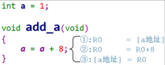
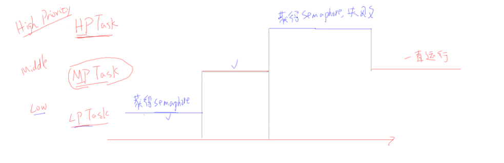

# 一. 互斥量使用说明
## 1.1. 什么是互斥量
* 互斥量是一种特殊的二进制信号量。
* 防止多任务同时抢占资源（变量，内存）
例如一个简单变量也可能被多任务同时强占,导致结果异常

## 1.2. 互斥量和二进制信号量差别
* 互斥量有优先级反转、优先级继承
    二进制互斥会出现优先级反转

    互斥量互斥会避免优先级反转

## 1.3.互斥量API
* 创建
```C
/* 创建一个互斥量，返回它的句柄。
* 此函数内部会分配互斥量结构体
* 返回值: 返回句柄，非 NULL 表示成功
*/
SemaphoreHandle_t xSemaphoreCreateMutex( void );
/* 创建一个互斥量，返回它的句柄。
* 此函数无需动态分配内存，所以需要先有一个 StaticSemaphore_t 结构体，并传入它的指
针
* 返回值: 返回句柄，非 NULL 表示成功
*/
SemaphoreHandle_t xSemaphoreCreateMutexStatic( StaticSemaphore_t *pxMutexBuffer );
```

* 删除
```C
/*
* xSemaphore: 信号量句柄，你要删除哪个信号量, 互斥量也是一种信号量
*/
void vSemaphoreDelete( SemaphoreHandle_t xSemaphore )
```

* give/take
```C
/* 释放 */
BaseType_t xSemaphoreGive( SemaphoreHandle_t xSemaphore );

/* 释放(ISR 版本) */
BaseType_t xSemaphoreGiveFromISR(SemaphoreHandle_t xSemaphore, BaseType_t*pxHigherPriorityTaskWoken
 );

/* 获得 */
BaseType_t xSemaphoreTake(SemaphoreHandle_t xSemaphore, TickType_t xTicksToWait);

/* 获得(ISR 版本) */
xSemaphoreGiveFromISR(SemaphoreHandle_t xSemaphore, BaseType_t *pxHigherPriorityTaskWoken);
```


# 互斥量原理
* 互斥量本质和二进制信号量差不多
```C
/*
*ucQueueType = queueQUEUE_TYPE_MUTEX
*/
 QueueHandle_t xQueueCreateMutex( const uint8_t ucQueueType )
    {
        QueueHandle_t xNewQueue;
        const UBaseType_t uxMutexLength = ( UBaseType_t ) 1, uxMutexSize = ( UBaseType_t ) 0;

        xNewQueue = xQueueGenericCreate( uxMutexLength, uxMutexSize, ucQueueType );
        prvInitialiseMutex( ( Queue_t * ) xNewQueue );

        return xNewQueue;
    }
```

* 优先级继承
```C
//在xQueueSemaphoreTake时会把mutex持有者优先级提高
if( pxQueue->uxQueueType == queueQUEUE_IS_MUTEX )
    {
    taskENTER_CRITICAL();
    xInheritanceOccurred = xTaskPriorityInherit(pxQueue->uxSemaphore.xMutexHolder );
    taskEXIT_CRITICAL();
}
```

* 优先级继承恢复
```C
//在prvCopyDataToQueue时，即高优先级take到mutex后要恢复之前的优先级继承
if( pxQueue->uxQueueType == queueQUEUE_IS_MUTEX )
{
                    /* The mutex is no longer being held. */
    xReturn = xTaskPriorityDisinherit( pxQueue->u.xSemaphore.xMutexHolder );
    pxQueue->u.xSemaphore.xMutexHolder = NULL;
}
```