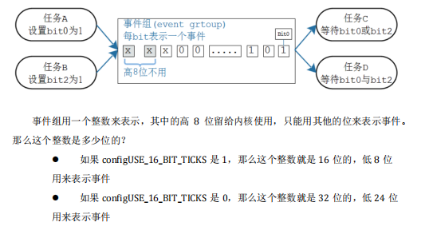
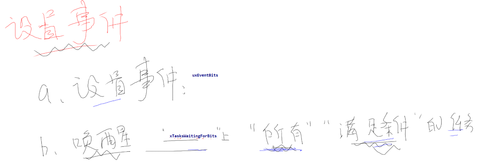
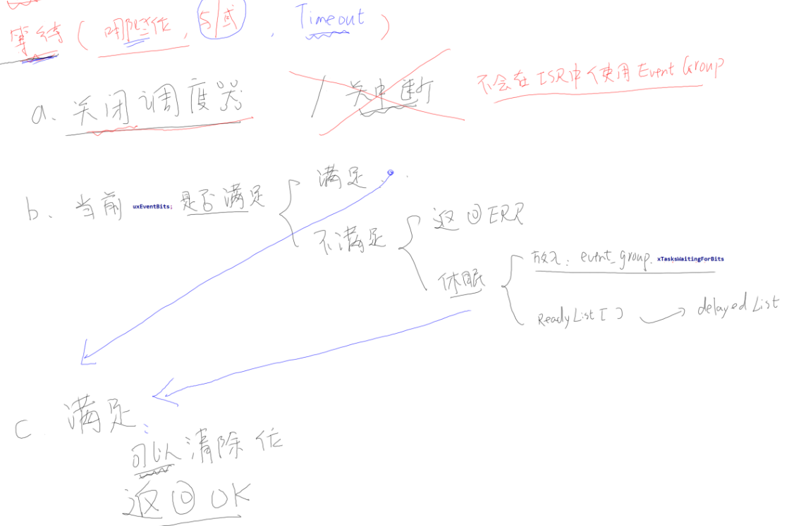
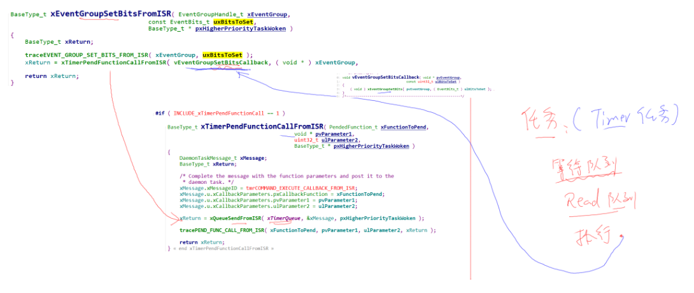

# 一. 事件组的使用

## 1.1. 什么是事件组

    事件组可以简单地认为就是一个整数：

* 整数的每一位表示一个事件
* 每一位事件的含义由程序员决定，比如：Bit0 表示用来串口是否就绪，bit1 表示按键是否被按下
* 这些位，值为 1 表示事件发生了，值为 0 表示事件没发生
* 一个或多个任务、ISR 都可以去写这些位；一个或多个任务、ISR 都可以去读这些位
* 可以等待某一位、某些位中的任意一个，也可以等待多位
  

## 1.2. 事件组api

* 创建
  使用事件组之前，要先创建，得到一个句柄；使用事件组时，要使用句柄来表明使用哪个事件组

```C
/* 创建一个事件组，返回它的句柄。
* 此函数内部会分配事件组结构体
* 返回值: 返回句柄，非 NULL 表示成功
*/
EventGroupHandle_t xEventGroupCreate( void );
/* 创建一个事件组，返回它的句柄。
* 此函数无需动态分配内存，所以需要先有一个 StaticEventGroup_t 结构体，并传入它的指
针
* 返回值: 返回句柄，非 NULL 表示成功
*/
EventGroupHandle_t xEventGroupCreateStatic( StaticEventGroup_t * pxEventGroupBuffer )
```

* 删除
  对于动态创建的事件组，不再需要它们时，可以删除它们以回收内存。

```C
/*
* xEventGroup: 事件组句柄，你要删除哪个事件组
*/
void vEventGroupDelete( EventGroupHandle_t xEventGroup )
```

* 设置事件

```C
/* 设置事件组中的位
* xEventGroup: 哪个事件组
* uxBitsToSet: 设置哪些位? 
* 如果 uxBitsToSet 的 bitX, bitY 为 1, 那么事件组中的 bitX, bitY 被设置为 1
* 可以用来设置多个位，比如 0x15 就表示设置 bit4, bit2, bit0
* 返回值: 返回原来的事件值(没什么意义, 因为很可能已经被其他任务修改了)
*/
EventBits_t xEventGroupSetBits( EventGroupHandle_t xEventGroup,
 const EventBits_t uxBitsToSet );
/* 设置事件组中的位
* xEventGroup: 哪个事件组
* uxBitsToSet: 设置哪些位? 
* 如果 uxBitsToSet 的 bitX, bitY 为 1, 那么事件组中的 bitX, bitY 被设置为 1
* 可以用来设置多个位，比如 0x15 就表示设置 bit4, bit2, bit0
* pxHigherPriorityTaskWoken: 有没有导致更高优先级的任务进入就绪态? pdTRUE-有, pdFA
LSE-没有
* 返回值: pdPASS-成功, pdFALSE-失败
*/
BaseType_t xEventGroupSetBitsFromISR( EventGroupHandle_t xEventGroup,
 const EventBits_t u
xBitsToSet,
 BaseType_t * pxHi
gherPriorityTaskWoken );
```

* 等待事件
  使用 xEventGroupWaitBits 来等待事件，可以等待某一位、某些位中的任意一个，也可以等待多位；等到期望的事件后，还可以清除某些位。

```C
EventBits_t xEventGroupWaitBits( EventGroupHandle_t xEventGroup,
 const EventBits_t uxBitsToWaitFor,
 const BaseType_t xClearOnExit,
 const BaseType_t xWaitForAllBits,
 TickType_t xTicksToWait );
```

函数参数说明列表如下

| 参数            | 说明                                                                                                                               |
| --------------- | ---------------------------------------------------------------------------------------------------------------------------------- |
| xEventGroup     | 事件组句柄                                                                                                                         |
| uxBitsToWaitFor | 等待哪些位？                                                                                                                       |
| xWaitForAllBits | 是"AND"还是"OR"？<br />pdTRUE: 等待的位，全部为 1;<br />pdFALSE: 等待的位，某一个为 1 即可                                         |
| xClearOnExit    | 函数退出前是否要清除事件？<br />pdTRUE: 清除 uxBitsToWaitFor 指定的位<br />pdFALSE: 不清除                                         |
| xTicksToWait    | 等待的事件未发生，阻塞多久。<br />设置为 0：判断后即刻返回；<br />设置为 portMAX_DELAY：一定等到成功才返回                         |
| 返回值          | 返回的是事件值<br />如果期待的事件发生了，返回的是"非阻塞条件成立"时的事件值；<br />如果是超时退出，返回的是超时时刻当前的事件值。 |


**PS: 你可以使用 xEventGroupWaitBits() 等待期望的事件，它发生之后再使用xEventGroupClearBits()来清除。但是这两个函数之间，有可能被其他任务或中断抢占，它们可能会修改事件组。**

**可以使用设置 xClearOnExit 为 pdTRUE ，使得对事件组的测试、清零都在xEventGroupWaitBits()函数内部完成，这是一个原子操作。**


# 二. 事件组原理分析
## 2.1. event句柄
```C
typedef struct EventGroupDef_t
{
    EventBits_t uxEventBits;
    List_t xTasksWaitingForBits; /*< List of tasks waiting for a bit to be set. */

    #if ( configUSE_TRACE_FACILITY == 1 )
        UBaseType_t uxEventGroupNumber;
    #endif

    #if ( ( configSUPPORT_STATIC_ALLOCATION == 1 ) && ( configSUPPORT_DYNAMIC_ALLOCATION == 1 ) )
        uint8_t ucStaticallyAllocated; /*< Set to pdTRUE if the event group is statically allocated to ensure no attempt is made to free the memory. */
    #endif
} EventGroup_t;
```
## 2.2. 设置事件
```C
//为什么写bit时只有关调度vTaskSuspendAll();不是把所有中断关了？
//答案在后面的“2.4. 中断设置event”
EventBits_t xEventGroupSetBits( EventGroupHandle_t xEventGroup,
                                const EventBits_t uxBitsToSet )
{
    ListItem_t * pxListItem, * pxNext;
    ListItem_t const * pxListEnd;
    List_t const * pxList;
    EventBits_t uxBitsToClear = 0, uxBitsWaitedFor, uxControlBits;
    EventGroup_t * pxEventBits = xEventGroup;
    BaseType_t xMatchFound = pdFALSE;


    pxList = &( pxEventBits->xTasksWaitingForBits );
    pxListEnd = listGET_END_MARKER( pxList ); /*lint !e826 !e740 !e9087 The mini list structure is used as the list end to save RAM.  This is checked and valid. */
    vTaskSuspendAll(); 
    {
        traceEVENT_GROUP_SET_BITS( xEventGroup, uxBitsToSet );

        pxListItem = listGET_HEAD_ENTRY( pxList );

        /* Set the bits. */
        pxEventBits->uxEventBits |= uxBitsToSet;

        /* See if the new bit value should unblock any tasks. */
        while( pxListItem != pxListEnd )
        {
            pxNext = listGET_NEXT( pxListItem );
            uxBitsWaitedFor = listGET_LIST_ITEM_VALUE( pxListItem );
            xMatchFound = pdFALSE;

            /* Split the bits waited for from the control bits. */
            uxControlBits = uxBitsWaitedFor & eventEVENT_BITS_CONTROL_BYTES;
            uxBitsWaitedFor &= ~eventEVENT_BITS_CONTROL_BYTES;

            if( ( uxControlBits & eventWAIT_FOR_ALL_BITS ) == ( EventBits_t ) 0 )
            {
                /* Just looking for single bit being set. */
                if( ( uxBitsWaitedFor & pxEventBits->uxEventBits ) != ( EventBits_t ) 0 )
                {
                    xMatchFound = pdTRUE;
                }
                else
                {
                    mtCOVERAGE_TEST_MARKER();
                }
            }
            else if( ( uxBitsWaitedFor & pxEventBits->uxEventBits ) == uxBitsWaitedFor )
            {
                /* All bits are set. */
                xMatchFound = pdTRUE;
            }
            else
            {
                /* Need all bits to be set, but not all the bits were set. */
            }

            if( xMatchFound != pdFALSE )
            {
                /* The bits match.  Should the bits be cleared on exit? */
                if( ( uxControlBits & eventCLEAR_EVENTS_ON_EXIT_BIT ) != ( EventBits_t ) 0 )
                {
                    uxBitsToClear |= uxBitsWaitedFor;
                }
                else
                {
                    mtCOVERAGE_TEST_MARKER();
                }

                /* Store the actual event flag value in the task's event list
                 * item before removing the task from the event list.  The
                 * eventUNBLOCKED_DUE_TO_BIT_SET bit is set so the task knows
                 * that is was unblocked due to its required bits matching, rather
                 * than because it timed out. */
                vTaskRemoveFromUnorderedEventList( pxListItem, pxEventBits->uxEventBits | eventUNBLOCKED_DUE_TO_BIT_SET );
            }

            /* Move onto the next list item.  Note pxListItem->pxNext is not
             * used here as the list item may have been removed from the event list
             * and inserted into the ready/pending reading list. */
            pxListItem = pxNext;
        }

        /* Clear any bits that matched when the eventCLEAR_EVENTS_ON_EXIT_BIT
         * bit was set in the control word. */
        pxEventBits->uxEventBits &= ~uxBitsToClear;
    }
    ( void ) xTaskResumeAll();

    return pxEventBits->uxEventBits;
}
```


## 2.3. 等待事件

## 2.4. 中断设置event

    1. 为什么不直接设置

    a. 设置event时还要去唤醒所有等待event 任务，只有中断的执行时间不可控。如果等待的认为很多，会导致中断执行时间很长，违背了RTOS初中
    
