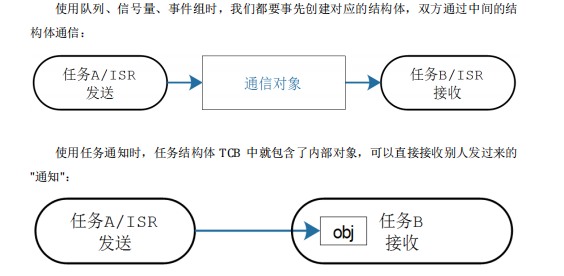
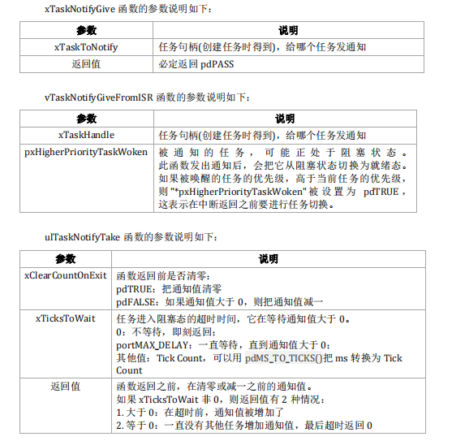
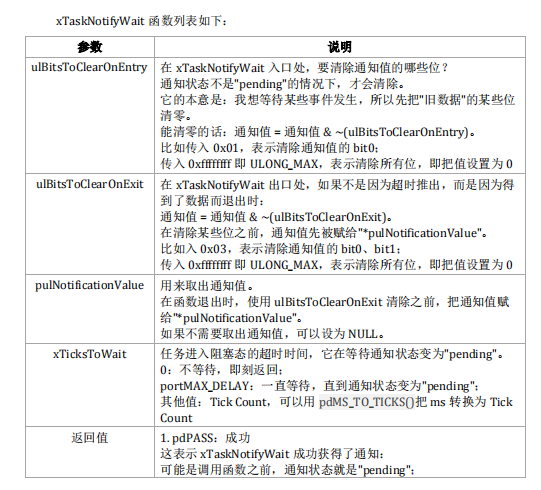

# 一.任务通知使用

## 1.1. 何为任务通知

* 我们使用队列、信号量、事件组等等方法时，并不知道对方是谁。使用任务通知时，可以明确指定：通知哪个任务。
* 使用任务通知时，任务结构体 TCB 中就包含了内部对象，可以直接接收别人发过来的"通知"：
  

## 1.2. 优势及限制

优势:

* 效率更高：使用任务通知来发送事件、数据给某个任务时，效率更高。比队列、信号量、事件组都有大的优势。
* 更节省内存：使用其他方法时都要先创建对应的结构体，使用任务通知时无需额外创建结构体。

限制:

* 不能发送数据给 ISR：
* 数据只能给该任务独享
* 无法缓冲数据

## 1.3. notification api使用

任务通知有 2 套函数，简化版、专业版，列表如下:

* 简化版函数的使用比较简单，它实际上也是使用专业版函数实现的
* 专业版函数支持很多参数，可以实现很多功能

|          | 简化版                                      | 专业版                              |
| -------- | ------------------------------------------- | ----------------------------------- |
| 发出通知 | xTaskNotifyGive<br />vTaskNotifyGiveFromISR | xTaskNotify<br />xTaskNotifyFromISR |
| 取出通知 | ulTaskNotifyTake                            | xTaskNotifyWait                     |

### 1.3.1. xTaskNotifyGive/ulTaskNotifyTake

在任务中使用 xTaskNotifyGive 函数，在 ISR 中使用 vTaskNotifyGiveFromISR 函数，都是直接给其他任务发送通知：

* 使得通知值加一
* 并使得通知状态变为"pending"，也就是 taskNOTIFICATION_RECEIVED，
  表示有数据了、待处理

可以使用 ulTaskNotifyTake 函数来取出通知值

* 如果通知值等于 0，则阻塞(可以指定超时时间)
* 当通知值大于 0 时，任务从阻塞态进入就绪态
* 在 ulTaskNotifyTake 返回之前，还可以做些清理工作：把通知值减一，或
  者把通知值清零
* 使用 ulTaskNotifyTake 函数可以实现轻量级的、高效的二进制信号量、计数型信号量

```C
BaseType_t xTaskNotifyGive( TaskHandle_t xTaskToNotify );
void vTaskNotifyGiveFromISR( TaskHandle_t xTaskHandle, BaseType_t *pxHigherPriorityTa
skWoken );
uint32_t ulTaskNotifyTake( BaseType_t xClearCountOnExit, TickType_t xTicksToWait );
```

  

### 1.3.2. xTaskNotify/xTaskNotifyWait

  xTaskNotify 函数功能更强大，可以使用不同参数实现各类功能，比如:

* 让接收任务的通知值加一：这时 xTaskNotify()等同于 xTaskNotifyGive()
* 设置接收任务的通知值的某一位、某些位，这就是一个轻量级的、更高效
  的事件组
* 把一个新值写入接收任务的通知值：上一次的通知值被读走后，写入才成
  功（不会阻塞的）。这就是轻量级的、长度为 1 的队列
* 用一个新值覆盖接收任务的通知值：无论上一次的通知值是否被读走，覆
  盖都成功。类似 xQueueOverwrite()函数，这就是轻量级的邮箱

```C
BaseType_t xTaskNotify( TaskHandle_t xTaskToNotify, uint32_t ulValue, eNotifyAction 
eAction );
BaseType_t xTaskNotifyFromISR( TaskHandle_t xTaskToNotify,
 uint32_t ulValue,
 eNotifyAction eAction,
 BaseType_t *pxHigherPriorityTaskWoken );
BaseType_t xTaskNotifyWait( uint32_t ulBitsToClearOnEntry,
 uint32_t ulBitsToClearOnExit,
 uint32_t *pulNotificationValue,
 TickType_t xTicksToWait );
```

* xTaskNotify 函数的参数说明如下

| 参数          | 说明                                                                                                                                                                    |
| ------------- | ----------------------------------------------------------------------------------------------------------------------------------------------------------------------- |
| xTaskToNotify | 任务句柄(创建任务时得到)，给哪个任务发通知                                                                                                                              |
| ulValue       | 怎么使用 ulValue，由 eAction 参数决定                                                                                                                                   |
| eAction       | 见下表                                                                                                                                                                  |
| 返回值        | pdPASS：成功，大部分调用都会成功<br />pdFAIL：只有一种情况会失败，当 eAction 为eSetValueWithoutOverwrite<br />并且通知状态为"pending"(表示有新数据未读)，这时就会失败。 |

eNotifyAction 参数说明：

| eNotifyAction 取值        | 说明                                                                                                                                                                                 |
| ------------------------- | ------------------------------------------------------------------------------------------------------------------------------------------------------------------------------------ |
| eNoAction                 | 仅仅是更新通知状态为"pending"，未使用 ulValue。<br />这个选项相当于轻量级的、更高效的二进制信号量。                                                                                  |
| eSetBits                  | 通知值 = 原来的通知值<br />相当于轻量级的、更高效的事件组。                                                                                                                          |
| eIncrement                | 通知值 = 原来的通知值 + 1，未使用 ulValue。<br />相当于轻量级的、更高效的二进制信号量、计数型信号量。<br />相当于 xTaskNotifyGive()函数。                                            |
| eSetValueWithoutOverwrite | 不覆盖。<br />如果通知状态为"pending"(表示有数据未读)，<br />则此次调用 xTaskNotify 不做任何事，返回 pdFAIL。<br />如果通知状态不是"pending"(表示没有新数据)，则：通知值 = ulValue。 |
| eSetValueWithOverwrite    | 覆盖。<br />无论如何，不管通知状态是否为"pendng"，<br />通知值 = ulValue。                                                                                                           |

PS: xTaskNotifyFromISR 函数跟 xTaskNotify 很类似，就多了最后一个参数pxHigherPriorityTaskWoken。在很多 ISR 函数中，这个参数的作用都是类似的，使用场景如下：

* 被通知的任务，可能正处于阻塞状态
* xTaskNotifyFromISR 函数发出通知后，会把接收任务从阻塞状态切换为就绪态
* 如果被唤醒的任务的优先级，高于当前任务的优先级，则pxHigherPriorityTaskWoken被设置为 pdTRUE，这表示在中断返回之前要进行任务切换
  

  # 二. 任务通知原理分析
  * TCB中任务通知数据结构
  ```C
      #if ( configUSE_TASK_NOTIFICATIONS == 1 )
        volatile uint32_t ulNotifiedValue[ configTASK_NOTIFICATION_ARRAY_ENTRIES ];
        volatile uint8_t ucNotifyState[ configTASK_NOTIFICATION_ARRAY_ENTRIES ];
    #endif
    ```